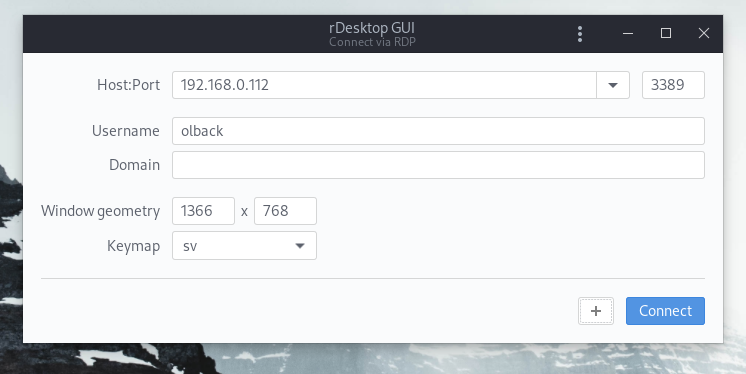

# rdesktop gui

Simplify rdesktop with rdesktop GUI.

## Build & install from source

Prerequisites: [Rust toolchain](https://www.rust-lang.org/)

1. `git clone https://github.com/olback/rdg-linux.git`
2. `cd rdg-linux`
3. `cargo build --release`
4. `sudo ./install.sh`

## Uninstall

1. `sudo ./install.sh uninstall`
2. Done!
