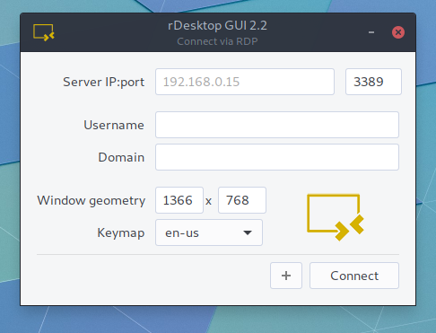

# rdesktop gui

Build:   

## Build and install from source
1. `git clone https://github.com/olback/rdg-linux.git`
2. `cd rdg-linux && make build`
3. `make install` (requires sudo)

## Update
To update, simply run `make update` within the project root.
